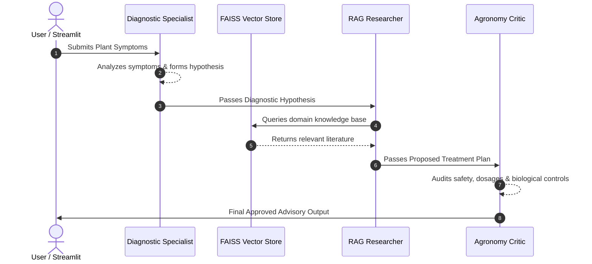

# 🌶️ ChiliDoc AI - Multi-Agent Agronomic System

ChiliDoc AI is an intelligent multi-agent agronomic advising system designed to assist chili farmers and agricultural officers. 
It combines **ReAct Reasoning**, **Retrieval-Augmented Generation (RAG)** via FAISS vector databases and **Reflection-based Safety Auditing** to deliver verified, actionable disease diagnostics and treatment recommendations.

---

## 🤖 System Architecture & Active Agents

The system uses three specialized LangChain AI agents working in sequence:

1. **Diagnostic Specialist Agent (ReAct)**: 
Analyzes symptom descriptions provided by the user using ReAct reasoning to formulate a preliminary diagnostic hypothesis.

2. **RAG Researcher Agent (Vector DB)**: 
Queries a FAISS vector database built from domain-specific agricultural literature to retrieve grounded research and evidence-based treatment options.

3. **Agronomy Critic Agent (Reflection)**: 
Evaluates the diagnosis and literature context for farmer safety, chemical dosage accuracy, and sustainability before generating the final approved advisory response.

---

## 🛠️ Tech Stack & Dependencies

* **Language**: Python 3.10+
* **Framework**: LangChain / LangGraph
* **UI Framework**: Streamlit
* **Vector Store**: FAISS
* **Embeddings & Vision/NLP Models**: HuggingFace / Transformers / Torchvision
* **Version Control**: Git & GitHub

---

## 🔄 Agent Communication Flow




---
## 🚀 How to Run Locally

### 1. Clone the Repository
```bash
git clone https://github.com/prabhasha-2001/chilidoc-ai.git
cd chilidoc-ai